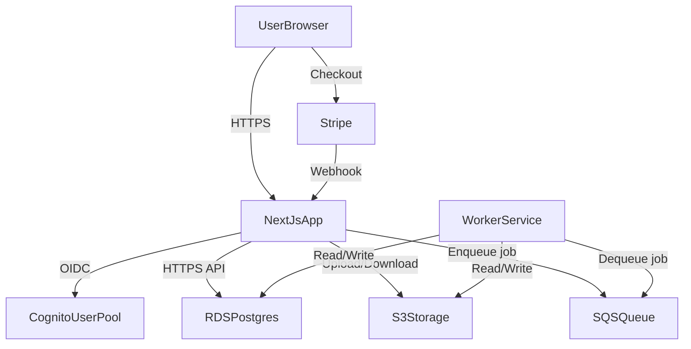

# DF StoryForge – Architecture

This document describes the system design, data model, and AWS components for DF StoryForge. It is intended for implementers and operators.

## Goals

- **User-facing web app** where Dwarf Fortress players:
  - Create accounts and log in
  - Upload DF game exports (and later, DFHack-enhanced exports)
  - Trigger generation of **comics** and **narrative stories** from uploads
  - View/download/share generated outputs
- **Operational requirements**:
  - Low-traffic, low-cost hosting
  - Docker-based deployment on AWS
  - Account system with free quota plus **paid credits** via a payment provider
  - Simple, maintainable architecture for a small team or solo maintainer

## High-Level Technical Stack

- **Language & framework**: TypeScript
- **Web app**: Next.js (app router) in full-stack mode
  - Server-side rendered pages, API routes for backend endpoints
  - Good DX, mature ecosystem, easy to dockerize
- **Auth**: AWS Cognito user pool + NextAuth (or similar) in the Next.js app
  - Cognito: cheap, generous free tier, stays inside AWS
  - NextAuth: simplifies session handling in Next.js
- **Payments & billing**: Stripe
  - Stripe Checkout + Customer Portal for one-off credit packs
  - Webhooks to credit users in your DB
- **Database**: PostgreSQL on AWS RDS
  - Stores users, uploads, jobs, stories/comics, credits, Stripe metadata
- **Storage**: S3
  - Raw DF exports
  - Generated story text (optionally cached)
  - Generated comic image assets
- **Background work**: SQS + worker container
  - Frontend/API container enqueues jobs
  - Worker container pulls jobs, runs generation, writes results
- **Hosting**: AWS App Runner (or ECS Fargate if you prefer)
  - App Runner for simplicity and low operational overhead; both run Docker images from ECR
- **Networking & security**: Route 53, ACM, security groups, IAM roles, S3 bucket policies
- **Secrets & config**: AWS SSM Parameter Store or AWS Secrets Manager
- **Observability**: CloudWatch Logs + basic CloudWatch Alarms
- **CI/CD**: GitHub Actions building Docker images, pushing to ECR, triggering App Runner/ECS deployment

## Core Features & User Flows

### 1. Authentication & Account Management

- **Sign-up & login**: Users register with email + password via Cognito Hosted UI or custom Next.js pages. Email verification; optional MFA later.
- **Session management**: NextAuth uses a Cognito provider; sessions in encrypted cookies.
- **Profile page**: Email, join date, credit balance, job history, default story/comic settings.
- **Account settings**: Change email, reset password (Cognito-hosted flows).

### 2. Credits & Billing

- **Credit model**: Initial free credit grant on sign-up (e.g., 20 generations). Each story/comic generation consumes 1+ credits. Store `credits_balance` and every `credit_transaction`.
- **Buying credits**: Predefined credit packs (e.g., 50, 200, 1000). User clicks “Buy credits” → Stripe Checkout. On success, webhook credits the user in the DB.
- **Billing history**: Page listing past Stripe payments (amount, date, credits purchased).

### 3. Uploads & Processing

- **Upload page**: Authenticated upload of DF exports (JSON/CSV/other). Server-side validation (type, size, basic safety). Store in S3; create `upload` row in DB.
- **Job creation**: User chooses story only, comic only, or both. System checks credits, deducts, creates `job` (status `queued`), enqueues SQS message.
- **Background worker**: Separate container consumes SQS; loads upload from S3; runs generation pipeline; saves story/comic outputs to S3; updates job status to `completed` or `failed`.
- **User experience**: After submit, user sees job status; poll (or SSE) until done; then links to story/comic.

### 4. Viewing & Managing Generated Content

- **Story viewer**: Formatted text, chaptered by events; download as `.txt`/`.md` (later `.pdf`).
- **Comic viewer**: Grid or paginated viewer; download panels or full set as `.zip`.
- **Library**: “My stories & comics” with filters (fortress, date, character, etc.).

### 5. DFHack Script Distribution

- **Scripts page**: Public page with install/run instructions and download links for script bundles (e.g., from S3). Sample exports and best practices.

## System Architecture Diagram

## Data Model (Initial Version)

PostgreSQL schema (high-level):

- **users**: `id`, `cognito_sub` (unique), `email`, `created_at`, `updated_at`, `credits_balance`, `stripe_customer_id`
- **credit_transactions**: `id`, `user_id`, `amount` (positive purchase, negative consumption/refund), `reason`, `stripe_payment_intent_id`, `created_at`
- **uploads**: `id`, `user_id`, `s3_key`, `file_name`, `file_size_bytes`, `df_version`, `export_type`, `created_at`
- **jobs**: `id`, `user_id`, `upload_id`, `status` (queued, processing, completed, failed), `requested_outputs` (JSON), `error_message`, `created_at`, `updated_at`, `completed_at`
- **stories**: `id`, `job_id`, `title`, `s3_key`, `preview_excerpt`, `metadata` (JSON), `created_at`
- **comics**: `id`, `job_id`, `title`, `config` (JSON), `created_at`
- **comic_panels**: `id`, `comic_id`, `panel_index`, `s3_key`, `caption`
- **webhook_events** (optional): `id`, `provider`, `event_id`, `payload`, `processed_at` – for idempotent Stripe webhook handling

## AWS Infrastructure Components

### Networking & DNS

- Route 53 hosted zone for your domain; ACM for TLS. App Runner custom domain or ALB + ECS.

### Application Hosting

- Two Docker images: `web` (Next.js), `worker` (SQS consumer + generation). ECR repos; App Runner or ECS Fargate.

### Database

- RDS PostgreSQL (e.g. `db.t4g.micro`). Automated backups; security group restricted to app/worker.

### Storage

- S3 bucket with prefixes: `uploads/`, `stories/`, `comics/`, `dfhack-scripts/`. IAM and bucket policies for least privilege.

### Messaging

- SQS standard queue for generation jobs; DLQ after N failures. Worker long-polls with visibility timeout tuned to max job duration.

### Authentication

- Cognito User Pool (email/password, optional MFA). App client for Next.js; NextAuth as OIDC client. App creates/updates local `users` row keyed by Cognito `sub`.

### Payments

- Stripe products/prices for credit packs. Webhook at `/api/webhooks/stripe`; idempotent handling to credit `users.credits_balance` and record `credit_transactions`.

### Observability

- CloudWatch Logs from App Runner/ECS; alarms on errors, SQS backlog, RDS CPU/storage.

## Security & Compliance Basics

- HTTPS only; encryption at rest (RDS, S3, Cognito). IAM roles for app and worker with least privilege. Privacy policy and terms; optional account deletion flow.

## Development Workflow

- **Local**: `docker-compose` with Postgres, MinIO or localstack for S3, ElasticMQ or dev SQS. Next.js and worker run locally with `.env`.
- **CI/CD**: GitHub Actions – lint, test, build Docker images, push to ECR, deploy to App Runner/ECS.

## UI/UX & Frontend Structure

- Dark theme, Dwarf Fortress–inspired. Key pages: Landing, Auth (login/signup/forgot password), Dashboard, Upload wizard, Job status, Story view, Comic view, Billing, DFHack scripts. Use Tailwind or a component library (e.g. Chakra, MUI).

## Summary of Recommended Services

| Concern        | Service / approach                    |
|----------------|----------------------------------------|
| Compute        | AWS App Runner (web + worker)          |
| Auth           | AWS Cognito + NextAuth                 |
| DB             | RDS PostgreSQL                         |
| Storage        | S3                                     |
| Queue          | SQS                                    |
| Payments       | Stripe (Checkout + webhooks)            |
| DNS / TLS      | Route 53 + ACM                         |
| Secrets        | SSM Parameter Store / Secrets Manager  |
| Logging        | CloudWatch Logs + Alarms               |
